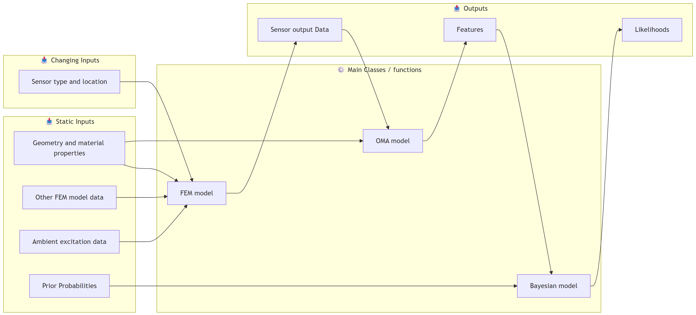

# Research Notebook (MSc Thesis)

Hi Evangelos and Luigi 👋

This repository is used to share my ongoing thesis progress ahead of our meetings.  You may optionally review it prior to the meeting to support discussion and feedback.  

➡ **Rendered notes (GitHub Pages):**
https://thygeminator.github.io/research-notebook/

The website contains the readable HTML version of my Quarto/Jupyter notebook

The repository itself only exists to generate the website — the page above is the intended way to read the material.

All content is preliminary and written as working notes rather than a structured report.
Some spelling or grammar errors may be present, as the notes are not proofread and mainly serve as a live record of ideas, code development, and ongoing work.

Thank you!

--- 
# Week 4 - Overview 

This last week Have i been Playing whit the the FEM modeling, Ambient excitation, and operational modal analysis. along whit ideas for an general structure of my code I think that I will organize my code in to 3 main classes: (see the illustration in the image below)

1. FEM-model: 
2. Operational modal analysis:
3. Bayesian model:
   - This class/function will call and use the other two classes.

Here are the most interesting sections: 

- [FEM Model](https://thygeminator.github.io/research-notebook/#fem-model), whit the [FEM class code](https://thygeminator.github.io/research-notebook/#class)  
   - Questions: 
     - **what is the best way to apply damping in the model?** (currently do i use Rayleigh damping based on the 2 modes with the highest modal participation factors in the X direction)
     - **Damping ratio = 0.03 ????** 
      
- [Ambient excitation](https://thygeminator.github.io/research-notebook/#ambient-excitation)
  - Explanation: I generate ground acceleration time series, as White noise randomly generated from an normal distribution in time steps of $dt$, I have also add the option of sorting out the frequencies out side an given range. 
  - Questions:
    - **what is the amplitude of Ambient excitations transformed to ground accelerations?**
    - currently do i only generate accelerations in the x-direction(horizontal direction), this do not activate modes in the y-direction(vertical direction), **should i also generate accelerations in the y-direction?** (i think that the excitation relative to the stiffens in the y-direction is so low that they shot be negligible, but i am not sure about this????)
    - **what value of dt should i use?**
    - **should i filter the frequencies of the ambient excitation?** and if so, **what frequency range should i use? and what is it based on?** 
- [Operational Modal Analysis (OMA)](https://thygeminator.github.io/research-notebook/#operational-modal-analysis-oma)
  - mostly just testing and trying to understand what to do.

  - note: the illustration of the **Bayesian model** is not perfect, because it is more an wrapper function there calls the other functions and gives them inputs.

---
# Questions

FEM Model: 

- I was looking at the [rayleigh command](https://openseespydoc.readthedocs.io/en/latest/src/reyleigh.html) and it seems like there are some different stiffness properties (betaKcurr, betaKinit, betaKcomm) do you know them? do you think that they can be used for stiffness updating in SHM ??? 
